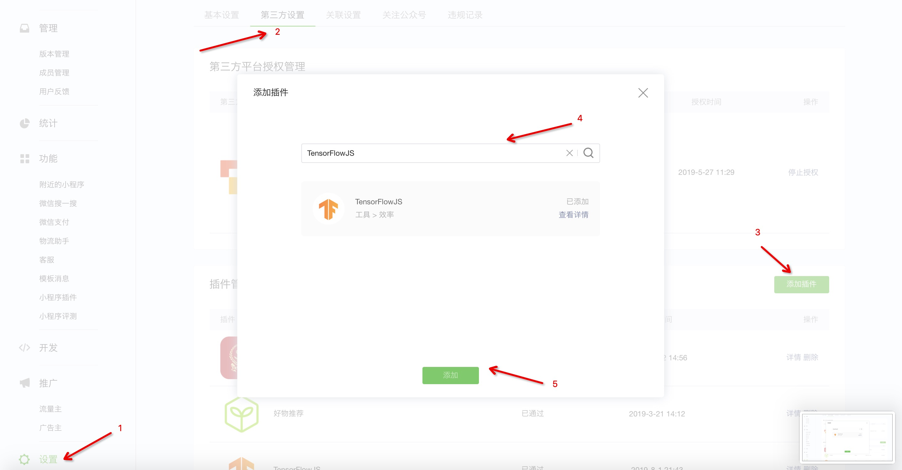

# 微信小程序与 tensorflow 的偶遇

1. 创建小程序项目。
2. 申请 TensorFlowJS 插件的使用。

- 小程序需要企业认证后才可以申请使用插件
- 添加方法：
  - 登录[小程序后台](https://mp.weixin.qq.com)
  - 设置 -> 第三方设置 -> 插件管理 -> 添加插件 ->搜索 TensorFlowJS -> 添加
  - 

3. TensorFlowJS 文档

- 在小程序的 app.json 中添加

  ```js
  "plugins": {
    "tfjsPlugin": {
    "version": "0.0.5",
    "provider": "wx6afed118d9e81df9"
    }
  }
  ```

- 打开终端，cd 到当前项目下，配置 npm
  - npm init
  - npm install @tensorflow/tfjs-core @tensorflow/tfjs-converter fetch-wechat regenerator-runtime @tensorflow-models/posenet
  - 安装好了之后在小程序开发工具上 工具 -> 构建 npm （每次安装一次 npm 包都要重新构建一下）。
  - 为什么安装这几个。
    - @tensorflow/tfjs-core: 基础包
    - @tensorflow/tfjs-converter：GraphModel 导入和执行包
    - fetch-wechat: 要使用 tf.loadGraphModel 或 tf.loadLayersModel API 来载入模型，需要此包填充 fetch 函数
    - regenerator-runtime: 用于异步加载 引入 await 和 async。
    - @tensorflow-models/posenet 识别人像的动作的模型 [详情](https://github.com/tensorflow/tfjs-models)
    - [模型种类详细查看](https://tensorflow.google.cn/js/models?hl=zh-CN)

4. 使用方法

- 在 app.js 中启用

```js
var fetchWechat = require('fetch-wechat')
var tf = require('@tensorflow/tfjs-core')
var plugin = requirePlugin('tfjsPlugin')
//app.js
App({
  onLaunch: function() {
    plugin.configPlugin({
      fetchFunc: fetchWechat.fetchFunc(),
      tf,
      canvas: wx.createOffscreenCanvas()
    })
  }
})
```

- 在 pages/index 中

  - index.wxml

    ```js
    <view class="container">
      <camera
        frame-size="small"
        device-position="back"
        flash="off"
        binderror="error"
        style="width:100%;height:100%"
      >
        <canvas canvas-id="pose" style="width:100%;height:100%" />
      </camera>
    </view>
    ```

  - index.js

    ```js
    async onReady() {
      const camera = wx.createCameraContext(this)
      this.canvas = wx.createCanvasContext("pose", this)
      this.loadPosenet() // 加载模型
      let count = 0
      const lister = camera.onCameraFrame((frame) => {
         count++
         if (count === 10) {
           if(this.net){
             this.drawImg(frame)
             }
             count = 0
             return
            }
          }
      )
    // lister.start() },
    ```

    - 初始化 camera、canvas、以及模型，
      监听 camera 的 onCameraFrame（需要设置 frame-size）,取 10 桢开始画。
    - loadPosenet 异步加载模型 [详情](https://github.com/tensorflow/tfjs-models/tree/master/posenet)

      ```js
      this.net = await posenet.load({
        architecture: 'MobileNetV1',
        outputStride: 16,
        inputResolution: 193, // 移动端为了性能
        multiplier: 0.5
      })
      ```

    - 处理图片信息

      ```js
      async deleFrame(frame,net){
      const imgData = {
        data: new Uint8Array(frame.data),
        width: frame.width,
        height: frame.height
      } // 获取图片的数据
      const imgSlice = tf.tidy(() => {
        // 此方法用于释放内存
        const imgTensor = tf.browser.fromPixels(imgData, 3)
        return imgTensor.slice([0, 0, 0], [-1, -1, 3]) //截取数据
      })
      const pose = await net.estimateSinglePose(imgSlice, {
        flipHorizontal: false // 不反转图片
      })
      imgSlice.dispose()
      return pose
      }
      ```

    - 根据处理好的数据画点线

      ```js
      async drawImg(frame){
      const pose = await this.deleFrame(frame, this.net)
      console.log(pose)
      if(pose == null || this.canvas == null ) return
      if(pose.score>=0.3 ){ // 姿势打分的数据
      for(let item in pose.keypoints){
      const point = pose.keypoints[item]
      if (point.score >= 0.5){
      const {x,y} = point.position
      this.drawCircle(this.canvas,x,y)
        }
      }
      // 画线
      const adjacentKeyPoints = posenet.getAdjacentKeyPoints(pose.keypoints,0.5)
      for (let i in adjacentKeyPoints){
      const points = adjacentKeyPoints[i]
      this.drawLine(this.canvas,points[0].position, points[1].position)
        }
        this.canvas.draw()
      }
      },
      ```

    - 画点

      ```js
      drawCircle(canvas,x,y){
        canvas.beginPath()
        canvas.arc(x*0.72,y*0.72,3,0,2*Math.PI)
        canvas.fillStyle = `aqua`
        canvas.fill()
      },
      ```

    - 画线

      ```js
      drawLine(canvas,pos0,pos1){
        canvas.beginPath()
        canvas.moveTo(pos0.x*0.72,pos0.y*0.72)
        canvas.lineTo(pos1.x*0.72,pos1.y*0.72)
        canvas.lineWidth = 2
        canvas.strokeStyle = `aqua`
        canvas.stroke()
      }
      ```

#### 注意事项

使用 tfjs-models 模型库注意事项

模型库提供了一系列训练好的模型，方便大家快速的给小程序注入 ML 功能。模型分类包括

- 图像识别
- 语音识别
- 人体姿态识别
- 物体识别
- 文字分类

由于这些 API 默认模型文件都存储在谷歌云上，直接使用会导致中国用户无法直接读取。在小程序内使用模型 API 时要提供 modelUrl 的参数，可以指向我们在谷歌中国的影像服务器。
谷歌云的 base url 是 https://storage.googleapis.com， 中国镜像的 base url 是https://www.gstaticcnapps.cn
模型的 url path 是一致的，比如

- posenet 模型的谷歌云地址是：
  https://storage.googleapis.com/tfjs-models/savedmodel/posenet/mobilenet/float/050/model-stride16.json
- 中国镜像的地址为 https://www.gstaticcnapps.cn/tfjs-models/savedmodel/posenet/mobilenet/float/050/model-stride16.json

他们的 URL Path 都是 /tfjs-models/savedmodel/posenet/mobilenet/float/050/model-stride16.json

#### tensorflow

- 官方文档 [TensorFlow.js](https://tensorflow.google.cn/js?hl=zh-CN)
- [模型](https://tensorflow.google.cn/js/models?hl=zh-CN)
- [API](https://js.tensorflow.org/api/latest/?hl=zh-CN)

#### 项目地址

https://github.com/xueyan1/wx_TensorFlow
